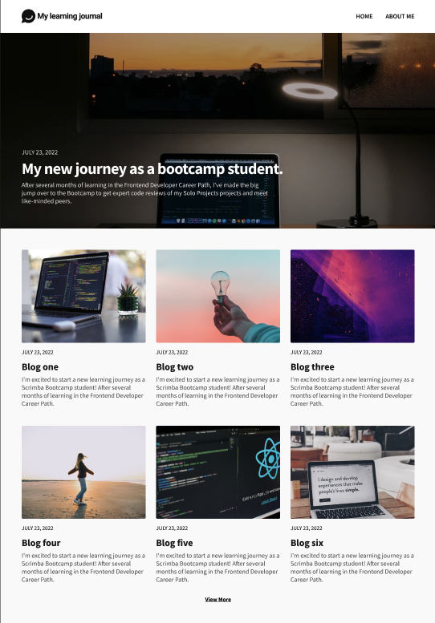

## Overview

### The challenge

This was a Scrimba solo project using HTML, CSS flexbox and grid to create a mock up Learning Journal.

### The requirements

Make all the pages responsive

- relative units
- mobile first design
- flexbox, grid, media queries

### Screenshot

- Consult Figma design files
- Create draft of README file
- Create .gitignore file
- Work on HTML and CSS files
- Create Github repository
- Check final code and accessibility
- Finalize README file
- Publish live URL
